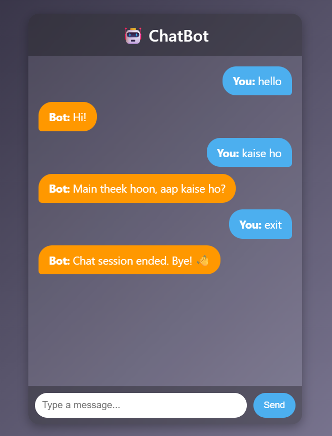
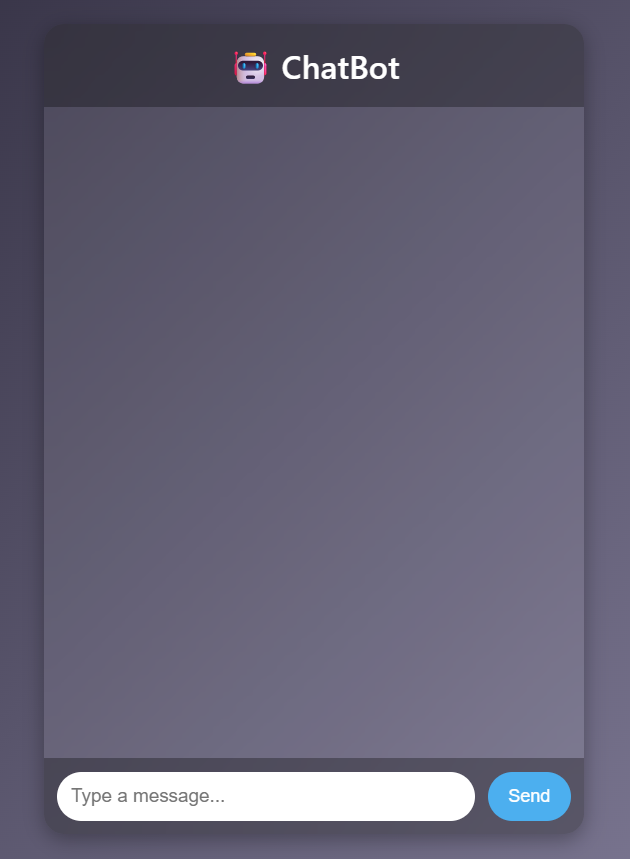

# 💬 Chatbot

An interactive and user-friendly chatbot application where you can chat with an AI-like bot that responds instantly.  
Built with **Python (Flask)**, **HTML**, **JavaScript**, and **CSS**, it features a clean and responsive interface.  
You can run it locally or host it online for others to use.

---

## 📂 Project Structure
```
.
├── screenshots/        # Images for README (UI previews)
├── static/             # CSS & JavaScript files
│   ├── style.css       # Styling for the chatbot UI
│   └── script.js       # Frontend logic for sending/receiving messages
├── templates/          # HTML templates
│   └── index.html      # Main chatbot interface
├── venv/               # Virtual environment files
├── app.py              # Python backend (Flask server)
├── requirements.txt    # Python dependencies
└── README.md           # Project documentation
```

---


## 📸 Chatbot Preview

<p align="center">
  
  
</p>

---

## 🚀 Features
- 💬 **Instant responses** – The chatbot replies instantly to user queries.
- 🎨 **Clean & modern UI** – Simple design that’s easy on the eyes.
- 📱 **Fully responsive** – Works perfectly on mobile, tablet, and desktop.
- ⚡ **Fast and lightweight** – Smooth performance with minimal delay.
- 🔄 **Conversation history** – See your past messages and bot replies.
- 🛠 **Easy to customize** – Change bot’s greeting, theme, and responses.

---

## 📦 Installation & Setup

Follow these steps to run the chatbot locally (If using with git clone):

```bash
# 1️⃣ Clone the repository
git clone https://github.com/hs74-codes/Chatbot.git

# 2️⃣ Navigate to the project folder
cd Chatbot

# 3️⃣ Install all dependencies from requirements.txt
pip install -r requirements.txt

# 4️⃣ Run the app
python app.py
```

Follow these steps to run the game locally (If using with git clone):
```
# 1️⃣ Download ZIP file and then extract it all

# 2️⃣ Navigate to the project folder
cd Chatbot

# 3️⃣ Install all dependencies from requirements.txt
pip install -r requirements.txt

# 4️⃣ Run the app
python app.py

```

## 📄 License
Project owned and copyrighted by hs74-codes
<br>
All rights reserved. Unauthorized copying or redistribution is prohibited.

